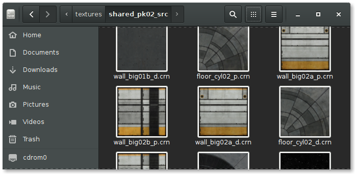

Crunch Thumbnailer
==================

Description
-----------

This is a thumbnailer for the [GNOME](https://www.gnome.org/) desktop. It generates thumbnails for `.ktx`, `.dds` and `.crn` texture files.

It relies on the [`crunch`](https://github.com/Unvanquished/crunch) tool to decode these files then it uses the `convert` tool from [ImageMagick](http://www.imagemagick.org/) to generate thumbnails.

Mime-type definitions for `image/ktx`, `image/x-dds` and `image/x-crn` are installed if they are missing.

How it looks
------------

Here is an example of thumbnails displayed by `nautilus`:



Installation
------------

```
./configure
make install
make update-db
```

About the thumbnailer
---------------------

It can be used by third party projects this way:

```
crunch-thumbnailer -s SIZE INFILE OUTFILE
```

Warning
-------

No warranty is given, use this at your own risk.

Author
------

Thomas Debesse <dev@illwieckz.net>

Copyright
---------

This tool is distributed under the highly permissive and laconic [ISC License](COPYING.md).
